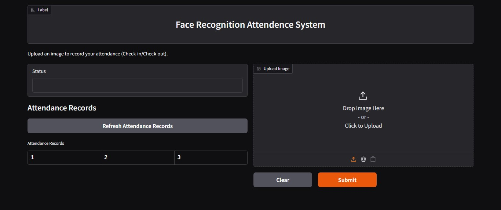

# Face Recognition Attendance System

This project implements a face recognition system for attendance tracking using a pre-trained ViT model and Gradio interface.



## Table of Contents

- [Project Overview](#project-overview)
- [Technical Stack](#technical-stack)
- [Coding Guidelines](#coding-guidelines)
- [Attendance Logic](#attendance-logic)
- [Testing & Validation](#testing--validation)
- [Deployment Guidelines](#deployment-guidelines)
- [File Structure](#file-structure)
- [Setup](#setup)
- [Additional Notes](#additional-notes)

## Project Overview

- **Objective**: Develop a face recognition-based attendance system that:
  - **Check-In**: Marks attendance when a student is recognized for the first time in a day.
  - **Check-Out**: Marks departure when the same student is recognized again on the same day.
- **Dataset**: Collected 10 facial images per student, organized in a directory structure where each subdirectory is named after the student's unique identifier (`dataset/student_id/`).
- **Model**: Utilizes the pre-trained model `jayanta/vit-base-patch16-224-in21k-face-recognition`, fine-tuned using the collected dataset.

## Technical Stack

- **Programming Language**: Python 3.10+
- **Libraries & Frameworks**:
  - `transformers`: For model loading and inference.
  - `torch`, `torchvision`: For deep learning operations.
  - `gradio`: For building the user interface.
  - `PIL` (Python Imaging Library): For image processing.

## Coding Guidelines

- **Code Structure**: Modularized into separate files:
  - `data_loader.py`: Handles data loading and preprocessing.
  - `model.py`: Contains model loading and inference functions.
  - `attendance.py`: Manages attendance logic and record-keeping.
  - `app.py`: Integrates all modules and runs the Gradio interface.
- **Naming Conventions**: `snake_case` for functions and variables, `PascalCase` for classes.
- **Documentation**: Include docstrings for all functions and classes, and comments for complex logic.
- **Error Handling**: Implement try-except blocks and log errors.

## Attendance Logic

- **Recognition Flow**:
  1. User uploads or captures an image.
  2. The system processes the image and predicts the student's identity.
  3. The system checks the attendance record:
     - If the student hasn't checked in today: Record check-in timestamp.
     - If the student has checked in but not out: Record check-out timestamp.
     - If both recorded: Notify attendance is complete for the day.
- **Data Storage**: Attendance records are maintained in `attendance_records.csv`.

## Testing & Validation

- **Test Cases**: Validate model predictions, test attendance logic scenarios.
- **Performance Metrics**: Monitor model accuracy, precision, recall, and system response time.

## Deployment Guidelines

- **Gradio Interface**: User-friendly interface with real-time feedback.
- **Hugging Face Spaces**: Dependencies listed in `requirements.txt`, thorough testing before deployment.

## File Structure

```
project_root/
├── data_loader.py
├── model.py
├── attendance.py
├── app.py
├── requirements.txt
├── dataset/
│   ├── student_1/
│   │   ├── img1.jpg
│   │   └── ...
│   └── student_n/
│       ├── img1.jpg
│       └── ...
├── attendance_records.csv
└── README.md
```

## Setup

1. Clone the repository.
2. Install dependencies: `pip install -r requirements.txt`
3. Organize your dataset in the `dataset/` directory with subdirectories for each student ID.
4. Run the application: `python app.py`

## Additional Notes

- **Security**: Avoid permanent storage of uploaded images, protect attendance records.
- **Scalability**: Design for easy addition of students, optimize model inference.
- **Maintenance**: Regularly update dataset, monitor logs. 